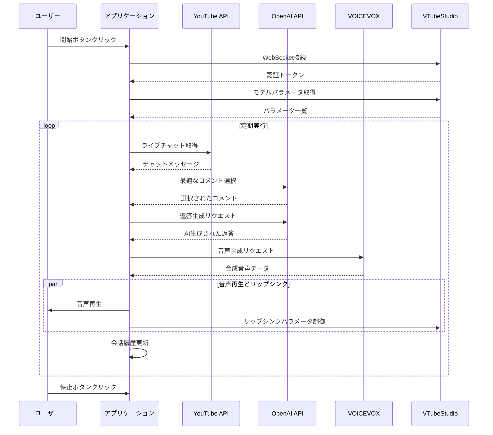

# AITuberのつくりかた サンプルアプリ

このアプリケーションは、YouTubeのライブ配信チャットに自動で返信するAIチャットボットのサンプル実装です。OpenAIのGPTモデルを使用して返答を生成し、VOICEVOXを使用して音声合成を行い、VTubeStudioと連携してLive2Dモデルのリップシンクを制御します。

## アプリケーションフロー



## 機能

- YouTubeライブ配信のチャットメッセージの取得
- OpenAI GPTを使用したチャットメッセージの選択と返答生成
- VOICEVOXを使用した音声合成
- VTubeStudioと連携したLive2Dモデルのリップシンク制御
- 会話履歴の管理と表示
- 各種設定のカスタマイズ

## 必要なAPI Key

- YouTube Data API v3のAPIキー
- OpenAI APIキー

## 設定項目

### YouTube設定
- **API Key**: YouTube Data API v3のAPIキー
- **配信ID**: 対象のYouTubeライブ配信のID
- **チャット取得間隔**: チャットを取得する間隔（秒）
- **メッセージの保持期間**: 処理済みメッセージを記憶しておく期間（秒）

### OpenAI設定
- **API Key**: OpenAI APIキー
- **モデル**: 使用するGPTモデル（gpt-4o-mini等）
- **システムプロンプト**: AIの応答の性格や特徴を定義するプロンプト
- **コメント選択プロンプト**: 返信するコメントを選択するための基準を定義するプロンプト

### VOICEVOX設定
- **エンドポイント**: VOICEVOXのAPIエンドポイント（デフォルト: http://localhost:50021 ）
- **話者ID**: 使用する話者のID

### 会話履歴設定
- **保持する会話数**: 表示・記憶する会話履歴の数（0-100）

## VTubeStudio連携

アプリケーションはVTubeStudioのプラグインAPIを使用して、Live2Dモデルの口の動きを制御します。

### リップシンク機能
- 音声の音量に基づく基本的な口の開閉制御
- 母音（a,i,u,e,o）の検出による詳細な口の形状制御
- VoiceA, VoiceI, VoiceU, VoiceE, VoiceOパラメータの活用（モデルが対応している場合）

### 注意事項
- 初回接続時にVTubeStudioでプラグインの認証が必要です
- Live2Dモデルに適切なパラメータが設定されている必要があります
- 使用できるパラメータはモデルによって異なります

## 使用方法

1. VOICEVOXをローカルで起動します
2. VTubeStudioを起動し、使用するLive2Dモデルを選択します
   ```bash
   1. VTubeStudioを起動
   2. 一般設定を開く
   3. 「VTuberStudio Plugins」でポート番号が8001であることを確認
   4. 「APIの起動」をオン
   ```
3. ローカルサーバーを起動します
   ```bash
   python -m http.server 3000
   ```
   その後、ブラウザで http://localhost:3000 にアクセスしてください
4. 必要なAPIキーを設定画面で入力します
5. YouTubeライブ配信のIDを設定します
6. 「開始」ボタンをクリックして処理を開始します
7. VTubeStudioでプラグインの認証を許可します
8. 「停止」ボタンで処理を終了できます

## エラー処理

アプリケーションは以下のような場合にエラーメッセージを表示します：

- YouTube APIキーが無効な場合
- 指定された動画が見つからない場合
- ライブ配信でない、またはライブチャットが無効な場合
- OpenAI APIキーが無効な場合
- VOICEVOXへの接続に失敗した場合

## デフォルト設定

```javascript
const DEFAULT_SETTINGS = {
  YOUTUBE_API_KEY: 'YOUR_YOUTUBE_API_KEY',
  VIDEO_ID: 'LIVE_STREAM_ID',
  WAIT_TIME: 10,
  MESSAGE_LIFETIME: 300,
  OPENAI_API_KEY: 'YOUR_OPENAI_API_KEY',
  OPENAI_MODEL: 'gpt-4o-mini',
  SYSTEM_PROMPT: '...',
  COMMENT_SELECTION_PROMPT: '...',
  VOICEVOX_ENDPOINT: 'http://localhost:50021',
  VOICEVOX_SPEAKER: 1,
  CONVERSATION_HISTORY_SIZE: 10
}
```